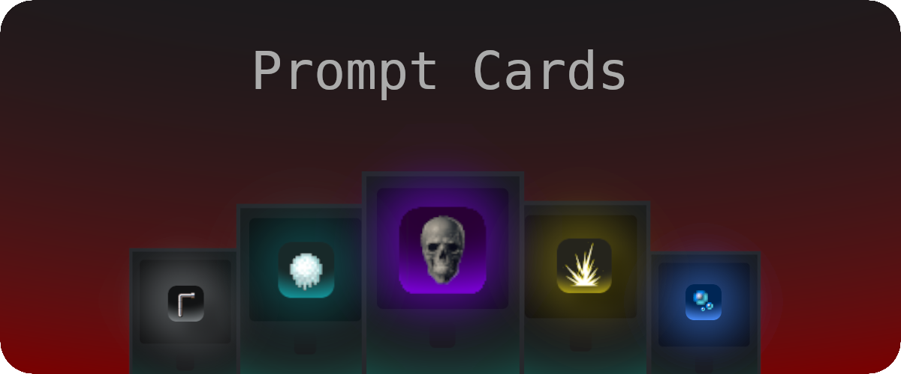

## Prompt Cards - JavaFX Edition

---




Um jogo de cartas estratégico offline (Player vs Bot) desenvolvido em Java utilizando JavaFX para a interface gráfica. O projeto é focado na aplicação prática dos fundamentos da Programação Orientada a Objetos (POO), incluindo herança, polimorfismo, encapsulamento, abstração e design patterns como Factory e Strategy.

Utiliza o ecossistema Maven para gerenciamento de dependências e Jackson para persistência de dados localmente (sem banco de dados SQL).


---


## 📋 Funcionalidades Principais

### Mecânicas

- **Duelos Offline**: Combate contra Bots com decks personalizados e comportamentos distintos.
- **Sistema de Turnos**: Compra de carta por turno, troca dinâmica no tabuleiro 1x2 e ataque automático ao finalizar o turno.
- **Mecânica de Elementos**: Sistema de vantagens e desvantagens entre elementos (ex: Fogo vs Gelo) que modifica atributos temporariamente durante o duelo.
- **Vitória**: O jogador vence ao eliminar todas as cartas do oponente; não há vida direta para o personagem/jogador.

### Padrões de Projetos

- **Factory Pattern (EfeitoFactory.java)**: Cria instâncias de `EfeitoCarta` dinamicamente baseadas no `TipoEfeito`. Evitando muitos `if/else`;
  
- **Strategy Pattern (EfeitoCarta + Interface + Implementações)**: O efeito da carta é uma estratégia intercambiável. A decisão do Bot (Fácil/Médio/Difícil) também muda a estratégia de jogo sem alterar a classe `Bot`, permitindo trocar algoritmos (efeitos, comportamento de IA) em tempo de execução;
  
- **Singleton (SessaoJogo.java)**: Uso de variáveis `static` privadas e construtor privado (`private SessaoJogo()`), garante que apenas uma sessão de jogo exista globalmente, permitindo centralização do estado global;
  
- **Builder (MontadorDeck.java + objetos complexos)**: A lógica de `montarDecksPadrao` separa a construção da estrutura dos dados;
  
- **Observer Pattern (CarregarSaveController.initialize())**: O botão `carregar` reage automaticamente à mudança de seleção. Padrão Observer nativo do JavaFX;
  
- **Command Pattern (JogadaResultado + jogarNoTabuleiro)**: Ações são encapsuladas em retornos de objetos de resultado.

---

## 📁 Estrutura do Projeto


```
├── card-game-1.0-SNAPSHOT.jar
├── doc
│   └── guia.pdf
├── .gitignore
├── .mvn
│   └── wrapper
│       ├── maven-wrapper.jar
│       └── maven-wrapper.properties
├── mvnw.cmd
├── pom.xml
├── Readme.md
├── saves
└── src
    └── main
        ├── java
        │   ├── com
        │   │   └── cardgame
        │   │       ├── effects
        │   │       │   ├── EfeitoCarta.java
        │   │       │   ├── EfeitoEscudoInicial.java
        │   │       │   └── EfeitoFactory.java
        │   │       ├── Launcher.java
        │   │       ├── logic
        │   │       │   ├── DueloResultado.java
        │   │       │   ├── MontadorDeck.java
        │   │       │   ├── PreparadorBatalha.java
        │   │       │   ├── SaveData.java
        │   │       │   ├── SessaoJogo.java
        │   │       │   └── SistemaCombate.java
        │   │       ├── Main.java
        │   │       ├── model
        │   │       │   ├── Bot.java
        │   │       │   ├── Carta.java
        │   │       │   ├── Deck.java
        │   │       │   ├── Elemento.java
        │   │       │   ├── JogadaResultado.java
        │   │       │   ├── JogadorHumano.java
        │   │       │   ├── Jogador.java
        │   │       │   └── TipoEfeito.java
        │   │       ├── persistence
        │   │       │   ├── RepositorioBots.java
        │   │       │   ├── RepositorioJSON.java
        │   │       │   └── RepositorioSave.java
        │   │       └── ui
        │   │           ├── AudioManager.java
        │   │           ├── CardNode.java
        │   │           ├── ControladorDeFluxo.java
        │   │           ├── controller
        │   │           │   ├── CarregarSaveController.java
        │   │           │   ├── JanelaBatalhaController.java
        │   │           │   ├── MenuPrincipalController.java
        │   │           │   ├── NicknameController.java
        │   │           │   ├── SelecaoAdversarioController.java
        │   │           │   └── SelecaoDeckController.java
        │   │           └── ScreenManager.java
        │   └── module-info.java
        └── resources
            ├── com
            │   └── cardgame
            │       ├── audio
            │       │   ├── fundo_menu.wav
            │       │   └── som_select.wav
            │       ├── css
            │       │   ├── estilo_adversario.css
            │       │   ├── estilo_batalha.css
            │       │   ├── estilo_deck.css
            │       │   └── estilo_menu.css
            │       ├── dados
            │       │   ├── bots.json
            │       │   └── cartas.json
            │       ├── fxml
            │       │   ├── estilo_menu.fxml
            │       │   ├── janela_batalha.fxml
            │       │   ├── menu_carregar_save.fxml
            │       │   ├── menu_principal.fxml
            │       │   ├── nickname.fxml
            │       │   ├── selecao_adversario.fxml
            │       │   └── selecao_deck.fxml
            │       └── img
            │           ├── cartas
            │           │   ├── carta01.png
            │           │   └── ...png
            │           ├── fundos
            │           │   └── fundo_menu.jpg
            │           ├── inimigos
            │           │   ├── inimigo01.png
            │           │   └── ...png
            │           └── Logo.png

```

---

## 📦 Instalando Prompt Cards

Certifique-se de que tenha baixado o **OpenJDK** Java 21 ou superior, pois ele já vem com suporte ao JavaFX!

Abra o terminal/prompt de comando em qualquer lugar e cole o comando abaixo:

```
git clone https://github.com/gabriel-melo19/Prompt-Cards.git
```

Para abrir a pasta:

```
cd Prompt-Cards
```


## 👾 Como jogar

Ainda no terminal/prompt de comando:

```
java -jar card-game-1.0-SNAPSHOT.jar
```

Se divirta!

---

## 👥 Colaboradores

- **Gabriel Melo**
- **Marcos William**
- **Wesley Kardozo**

